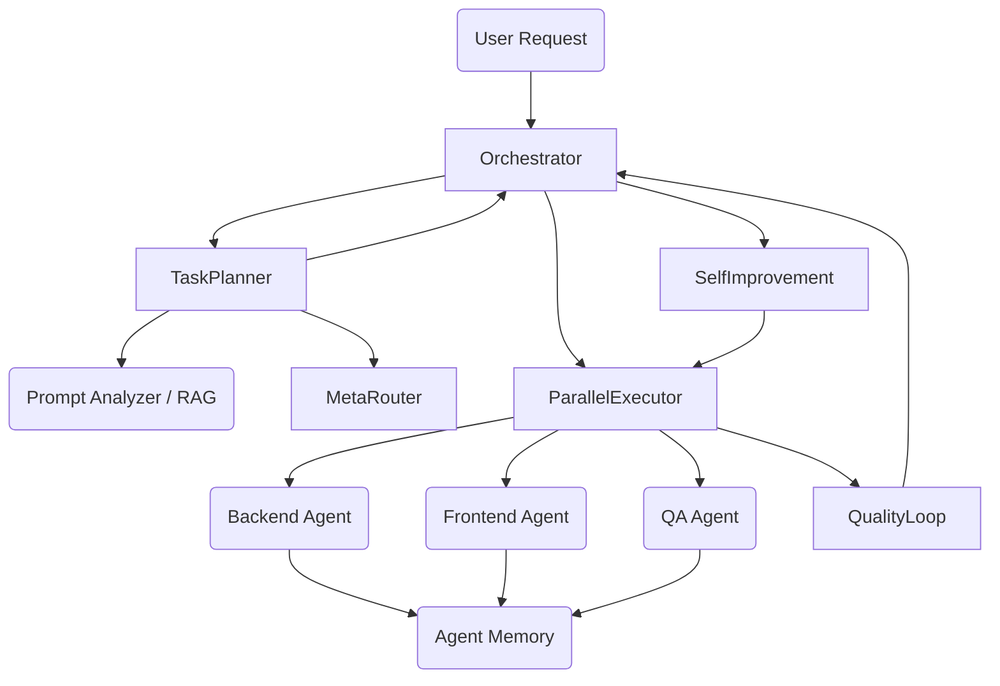

# Autonomous Multi-Agent Loop (Phase 8)

The Autonomous Loop in AI-Agent-OS is designed to take a high-level task, decompose it, and execute it using a dynamically assembled team of agents working in parallel.

## Architecture

The system lives in `src/autonomous/` and connects directly to the RAG system, the MetaRouter, and the ModelAdapter.



## Components

1. **Orchestrator (`orchestrator.py`)**: The main event loop. Manages the iterations (max 3 by default) to prevent infinite loops.
2. **Task Planner (`task_planner.py`)**: Merges insights from semantic RAG search and heuristic routing to determine the best agents for the job.
3. **Parallel Executor (`parallel_executor.py`)**: Uses Python's `asyncio` to execute multiple agent prompts against the model adapter concurrently.
4. **Agent Memory (`agent_memory.py`)**: A shared JSON state on disk that allows agents to append logs and read a shared context board.
5. **Quality Loop (`quality_loop.py`)**: Simulates a Reviewer agent that evaluates the merged output of the parallel execution step.
6. **Self Improvement (`self_improvement.py`)**: If the Reviewer rejects the output, it appends the feedback to the sub-tasks for the next iteration.

## Execution Example

```python
from src.autonomous.orchestrator import AutonomousOrchestrator

orchestrator = AutonomousOrchestrator()
result = orchestrator.run("Create a secure SaaS API backend with documentation")

print(result["status"]) # "success" or "failed"
```
