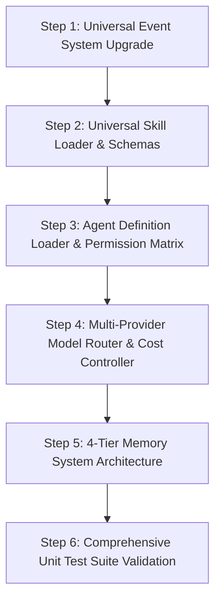

# IMPLEMENTATION PLAN — Core Systems Upgrade

**Document Version:** 1.0.0  
**Role:** Lead AI Systems Architect  
**Date:** 2026-07-31  

---

## 1. Executive Summary

This document specifies the technical implementation plan for upgrading **AI-Agent-OS** into a production-grade universal agent platform. The plan prioritizes **stability over speed**, leverages existing **Genesis_Harness** assets (`SKILL.md` and `AGENT.md` formats), and builds modular, fully testable Python components.

---

## 2. Core System Specifications

### 2.1 System 1: Universal Skill Loader (`src/registry/skill_loader.py`)

#### Objectives
1. Parse both YAML (`skill.yaml`) and Markdown (`SKILL.md` with YAML frontmatter) skill definitions.
2. Natively support Genesis_Harness skill formats.
3. Validate metadata, semantic versioning (`semver`), and dependency graphs (detect circular dependencies via Topological Sort).
4. Perform safe skill registration and runtime binding into agent instances.

#### Data Schemas (`src/schemas/skill_schema.py`)
- `SkillMetadata`: `name`, `version`, `description`, `author`, `tags`, `license`.
- `SkillRequirement`: `name`, `version_constraint` (e.g. `>=1.0.0`).
- `SkillDefinitionExtended`: Full parsed skill representation containing metadata, capabilities, code/prompt instructions, and security permissions.

#### Key Architecture
```
           +-----------------------+
           |     SKILL.md /        |
           |    skill.yaml         |
           +-----------+-----------+
                       |
                       v
         +-------------+-------------+
         |     Frontmatter / YAML    |
         |         Parser            |
         +-------------+-------------+
                       |
                       v
         +-------------+-------------+
         |   Dependency Resolver     |
         |   & Version Validator     |
         +-------------+-------------+
                       |
                       v
         +-------------+-------------+
         |    SkillRegistry Store    |
         +---------------------------+
```

---

### 2.2 System 2: Agent Registry & Definition Loader (`src/registry/agent_loader.py`)

#### Objectives
1. Load agent charters from `AGENT.md` (Genesis_Harness format) and YAML/JSON manifest files.
2. Define declarative Role, Persona, and System Prompts.
3. Implement Permission Matrices (RBAC/ABAC) specifying tool execution rights (e.g., `READ_ONLY`, `FILE_WRITE`, `EXECUTE_CODE`, `NETWORK_ACCESS`).
4. Bind required and optional Skills to Agents during initialization.
5. Provide tool access resolution logic.

#### Data Schemas (`src/schemas/agent_schema.py`)
- `PermissionPolicy`: Allowed tools, restricted paths, max execution time, rate limits.
- `AgentDefinition`: Full metadata manifest (`id`, `name`, `role`, `description`, `permissions`, `required_skills`, `allowed_tools`, `system_prompt`).

---

### 2.3 System 3: Universal Model Router (`src/models/universal_router.py`)

#### Objectives
1. Unified abstraction layer supporting:
   - **Google Gemini** (`gemini-1.5-pro`, `gemini-1.5-flash`, `gemini-2.0-flash`)
   - **OpenAI Compatible APIs** (`gpt-4o`, `gpt-4o-mini`, `o1`, `o3-mini`, vLLM, LocalAI)
   - **Anthropic Native** (`claude-3-5-sonnet`, `claude-3-opus`, `claude-3-haiku`)
   - **OpenRouter** (Unified gateway)
   - **Ollama** (Local models: `llama3`, `mistral`, `qwen`)
   - **Local Models** (Direct HTTP/REST adapters)
2. **Capability Matching**: Filter models based on requirements (`vision=True`, `function_calling=True`, `json_mode=True`, `min_context_window=128000`).
3. **Fallback Chains**: Failover to secondary/tertiary providers upon API rate limits (HTTP 429), timeouts, or service errors (HTTP 5xx).
4. **Cost Control & Budgeting**: Track token consumption (prompt tokens, completion tokens) and cost ($) per agent, task, and provider with configurable spend caps.
5. **Telemetry Logging**: Emits structured model invocation metrics.

---

### 2.4 System 4: Memory System Architecture (`src/memory/`)

#### Objectives
Provide a modular 4-tier memory hierarchy:
1. **Short-Term Memory (STM)** (`src/memory/short_term.py`):
   - Sliding window turn buffer, execution scratchpad, context window summarizer.
2. **Long-Term Memory (LTM)** (`src/memory/long_term.py`):
   - Persistent key-value state, user preferences, agent reflection logs.
3. **Knowledge Memory** (`src/memory/knowledge.py`):
   - RAG document store, chunking, and semantic search context.
4. **Vector Database Interface** (`src/memory/vector_db.py`):
   - Abstract adapter (`VectorStore`) for vector embeddings, similarity queries (Cosine/Euclidean), metadata filtering, with an in-memory reference implementation (`InMemoryVectorStore`).

---

### 2.5 System 5: Comprehensive Event System (`src/core/event.py`)

#### Objectives
Expand the event system to cover the full lifecycle of an enterprise agent OS:
- **Agent Events**: `agent.started`, `agent.stopped`, `agent.paused`, `agent.resumed`, `agent.state_changed`, `agent.error`
- **Task Events**: `task.created`, `task.started`, `task.progress`, `task.completed`, `task.failed`, `task.cancelled`
- **Tool Events**: `tool.requested`, `tool.executing`, `tool.completed`, `tool.failed`, `tool.permission_denied`
- **Model Events**: `model.request_started`, `model.response_received`, `model.fallback_triggered`, `model.budget_exceeded`

---

## 3. Step-by-Step Implementation Sequence



1. **Step 1 — Event System**:
   - Update `EventType` enum in `src/schemas/common.py`.
   - Update `EventBus` in `src/core/event.py` with topic pattern matching (e.g. `agent.*`, `tool.*`).

2. **Step 2 — Universal Skill Loader**:
   - Create `src/schemas/skill_schema.py`.
   - Upgrade `src/registry/skill_registry.py` to parse Markdown frontmatter (`SKILL.md`) and resolve skill dependencies.

3. **Step 3 — Agent Registry & Permissions**:
   - Create `src/schemas/agent_schema.py`.
   - Create `src/registry/agent_loader.py` for parsing `AGENT.md` charters and instantiating configured agents.

4. **Step 4 — Universal Model Router**:
   - Expand `src/models/router.py` & `src/models/providers.py` with multi-provider adapters (Gemini, OpenAI, Anthropic, OpenRouter, Ollama, Local).
   - Implement `CapabilityMatcher`, `FallbackChain`, and `TokenBudgetManager`.

5. **Step 5 — Memory System Architecture**:
   - Create `src/memory/base.py`, `src/memory/short_term.py`, `src/memory/long_term.py`, `src/memory/knowledge.py`, `src/memory/vector_db.py`.

6. **Step 6 — Verification & Testing**:
   - Add targeted test files in `tests/` covering every new subsystem.
   - Run complete test suite and verify 100% pass rate.

---

## 4. Stability & Safety Rules

- **Zero Breaking Changes**: Preserve existing public interfaces of `BaseAgent`, `Kernel`, `Task`, and `EventBus`.
- **Offline First Testability**: All provider adapters must gracefully fallback or work with `MockProvider` when API keys are absent.
- **Fail-Safe Permissions**: Tool execution defaults to `DENY` if permissions are not explicitly declared.
