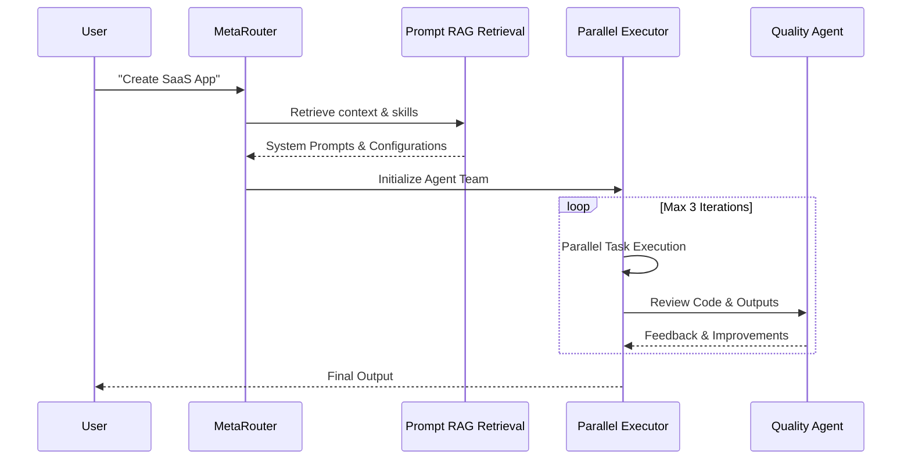

# Autonomous Loop

```mermaid
sequenceDiagram
    participant User
    participant Router as MetaRouter
    participant RAG as Prompt RAG Retrieval
    participant Exec as Parallel Executor
    participant QA as Quality Agent

    User->>Router: "Create SaaS App"
    Router->>RAG: Retrieve context & skills
    RAG-->>Router: System Prompts & Configurations
    Router->>Exec: Initialize Agent Team
    
    loop Max 3 Iterations
        Exec->>Exec: Parallel Task Execution
        Exec->>QA: Review Code & Outputs
        QA-->>Exec: Feedback & Improvements
    end
    
    Exec-->>User: Final Output
```
