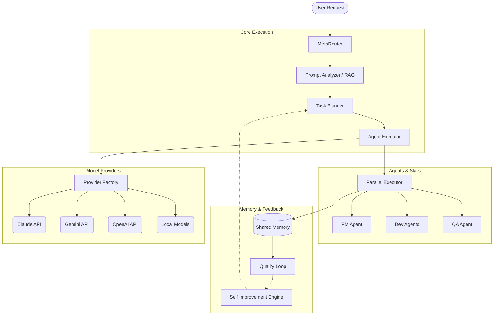

# OMNI-Agent-OS Architecture

```mermaid
graph TD
    User([User Request]) --> MetaRouter[MetaRouter]
    
    subgraph Core Execution
        MetaRouter --> PromptAnalyzer[Prompt Analyzer / RAG]
        PromptAnalyzer --> TaskPlanner[Task Planner]
        TaskPlanner --> AgentExecutor[Agent Executor]
    end

    subgraph Agents & Skills
        AgentExecutor --> ParallelExecutor[Parallel Executor]
        ParallelExecutor --> PM[PM Agent]
        ParallelExecutor --> Dev[Dev Agents]
        ParallelExecutor --> QA[QA Agent]
    end

    subgraph Memory & Feedback
        ParallelExecutor --> SharedMemory[(Shared Memory)]
        SharedMemory --> QualityLoop[Quality Loop]
        QualityLoop --> SelfImprovement[Self Improvement Engine]
        SelfImprovement -.-> TaskPlanner
    end

    subgraph Model Providers
        AgentExecutor --> ProviderFactory[Provider Factory]
        ProviderFactory --> Claude(Claude API)
        ProviderFactory --> Gemini(Gemini API)
        ProviderFactory --> OpenAI(OpenAI API)
        ProviderFactory --> Local(Local Models)
    end
```
